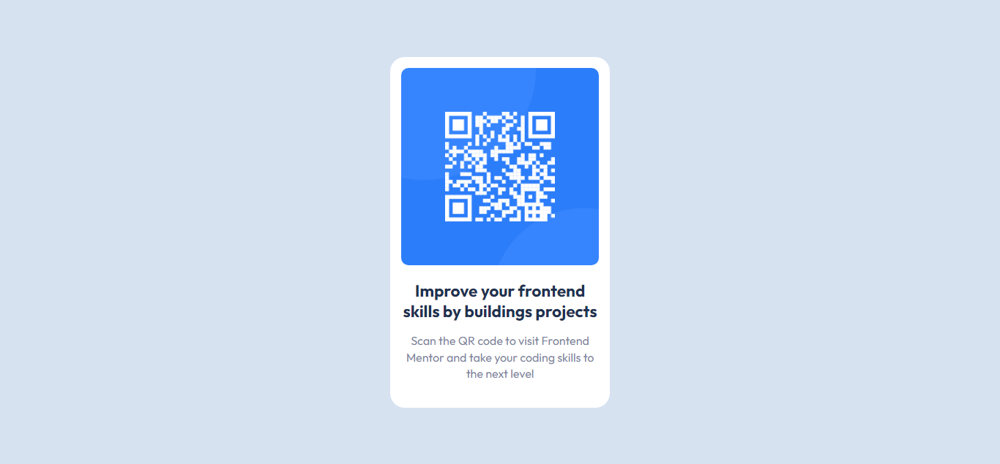

# Frontend Mentor - QR code component solution

## Table of contents

- [Overview](#overview)
  - [Screenshot](#screenshot)
  - [Links](#links)
- [Author](#author)

## Overview

### Screenshot

### Links

- Solution URL: [GitHub Link](https://github.com/robiulislam2520/qr-code-component)
- Live Site URL: [Live Site](https://robiulislam2520.github.io/qr-code-component/)

### Built with

- Semantic HTML5 markup
- CSS custom properties
- Flexbox

### Continued development

I wanna learn more and more as a front-end developer.

## Author

- Website - [Robiul Islam](https://robiul-islam.netlify.app/)
- Frontend Mentor - [@robiulislam2520](https://www.frontendmentor.io/profile/robiulislam2520)
